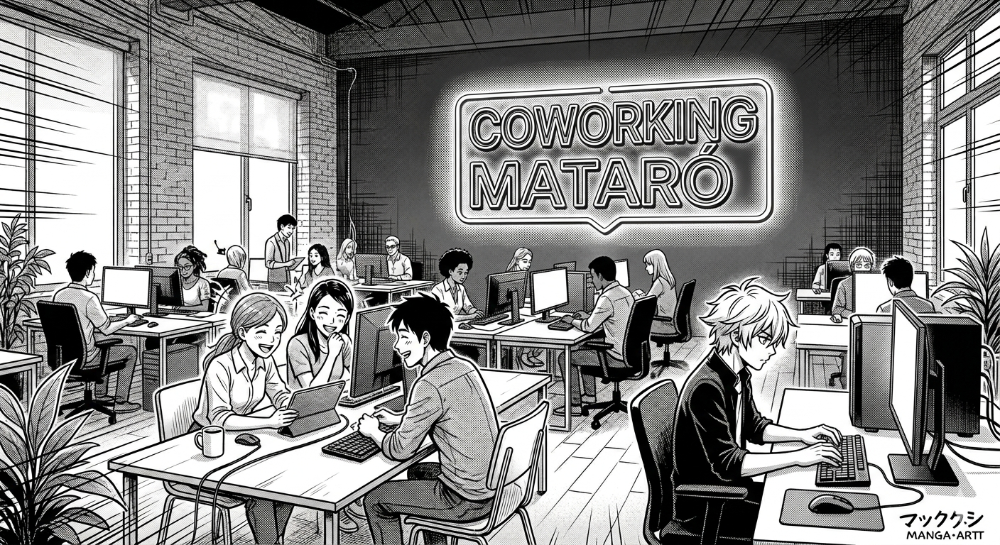
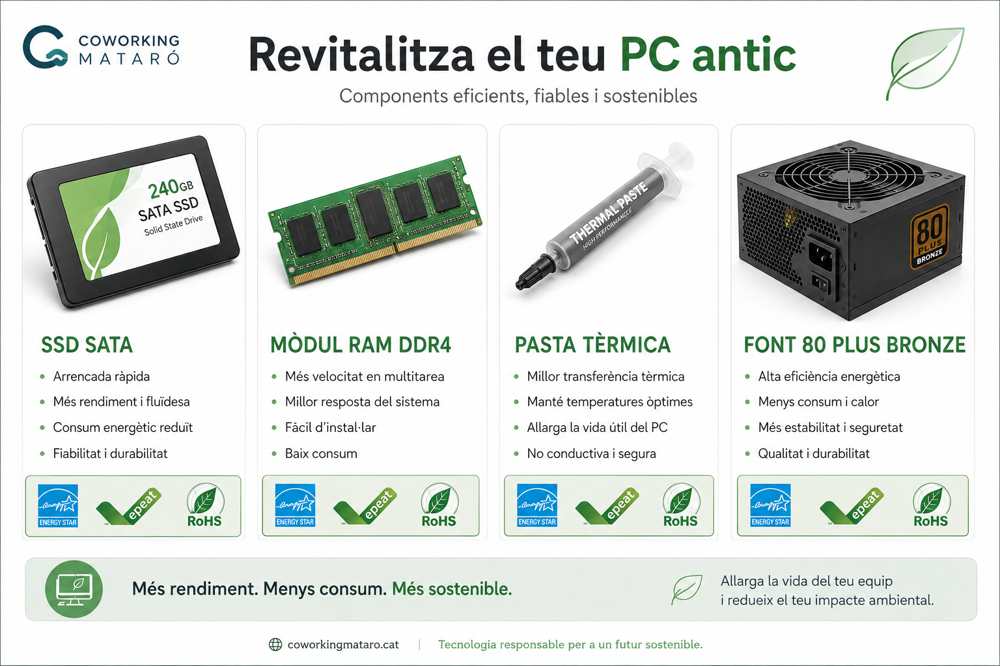
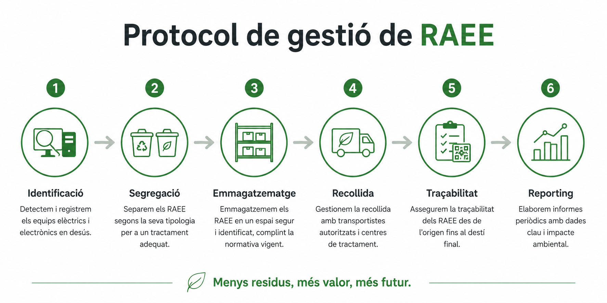
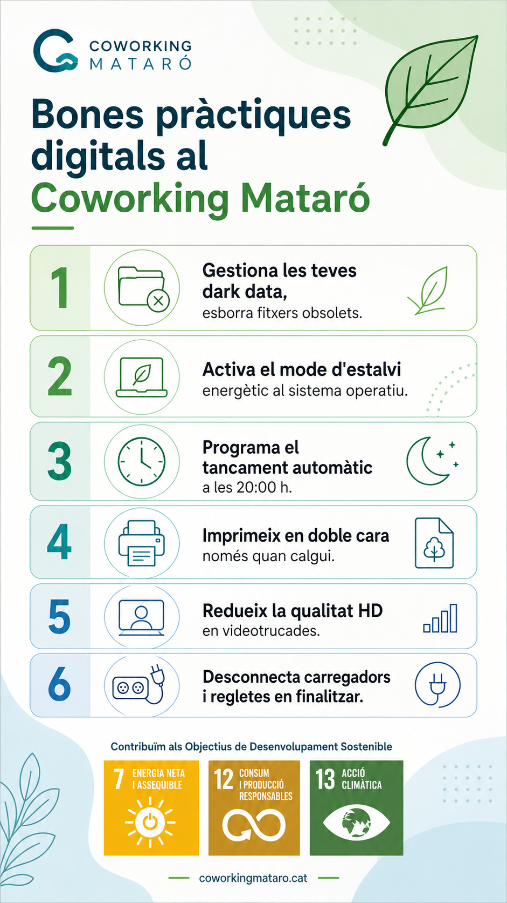

# 📋 Pla de Sostenibilitat Integral — Coworking Mataró



## 📑 Taula de continguts

1. [Introducció](#1-introducció)
2. [Diagnòstic i auditoria](#2-diagnòstic-i-auditoria)
3. [Proposta de solució](#3-proposta-de-solució)
4. [Pla d'acció i full de ruta](#4-pla-dacció-i-full-de-ruta)
5. [Indicadors i KPIs](#5-indicadors-i-kpis)
6. [Recursos visuals i prompts IA](#6-recursos-visuals-i-prompts-ia)
7. [Conclusions](#7-conclusions)

---

## 1. Introducció

### 1.1 Context del projecte

**Coworking Mataró** és un espai de treball compartit que disposa d'una infraestructura informàtica obsoleta i ineficient. L'empresa vol transformar el seu model actual cap a un enfocament d'**Economia Circular**, optimitzant el rendiment tècnic i reduint l'impacte ambiental.

Actuem com a consultors en pràctiques per dissenyar el pla de sostenibilitat integral, alineat amb els criteris **ASG** (Ambientals, Socials i de Governança) i els **Objectius de Desenvolupament Sostenible (ODS)** de l'Agenda 2030.

### 1.2 Dades del client

| Camp | Informació |
| --- | --- |
| **Raó social** | Coworking Mataró S.L. |
| **Sector** | Espais de treball compartit |
| **Ubicació** | Mataró (Barcelona) |
| **Equips informàtics** | 20 PCs + 1 servidor + magatzem |

### 1.3 Objectius de la proposta

Transformar la infraestructura IT de Coworking Mataró en un model circular i eficient, reduint un 20% la factura elèctrica i obtenint una certificació de sostenibilitat.

- **Eficiència energètica:** Reduir el consum elèctric un 20% en 12 mesos.
- **Economia circular:** Allargar la vida útil dels equips ≥ 3 anys mitjançant revitalització.
- **Gestió de residus:** Implementar un protocol RAEE traçable al 100%.
- **Certificació:** Aconseguir el reconeixement de sostenibilitat reconegut.

---

## 2. Diagnòstic i auditoria

### 2.1 Situació actual

| Element | Quantitat | Estat | Impacte |
| --- | --- | --- | --- |
| PCs sobretaula (2018) | 20 | HDD, 4 GB RAM, sobreescalfament | Consum elevat |
| Servidor físic | 1 | Sobredimensionat, 24/7 | Crític |
| Monitors antics | ~15 | Sense inventariar | Per determinar |
| Cables i perifèrics | Molts | Sense inventariar | Per determinar |

### 2.2 Grups d'interès (*stakeholders*)

| Grup d'interès | Interès principal | Influència |
| --- | --- | --- |
| Usuaris del coworking | Equipament fiable i espai sostenible | Alta |
| Direcció | Reducció de costos, imatge corporativa | Molt alta |
| Treballadors interns | Condicions laborals dignes | Alta |
| Administració pública | Compliment RAEE i RGPD | Alta |
| Gestors de residus | Segregació i traçabilitat correcta | Mitjana |
| Comunitat local | Reducció d'impacte ambiental | Mitjana |

### 2.3 Anàlisi de materialitat ASG

| Eix | Aspectes materials identificats |
| --- | --- |
| **Ambiental (A)** | Consum elèctric, residus electrònics, emissions CO₂, ecodisseny |
| **Social (S)** | Confort dels usuaris, formació digital, inclusió tecnològica |
| **Governança (G)** | Política de compres, indicadors, transparència i reporting |

### 2.4 Checklist d'auditoria

| ID | Element | Estat tècnic | Estat ambiental | Acció recomanada |
| --- | --- | --- | --- | --- |
| PC-01 a PC-20 | PCs sobretaula | Baix rendiment | Consum elevat | Revitalitzar (SSD + RAM) |
| SRV-01 | Servidor físic | Sobredimensionat | Consum 24/7 | Virtualitzar o migrar |
| MON-XX | Monitors magatzem | Per verificar | Per verificar | Inventariar i classificar |
| CAB-XX | Cables/perifèrics | Per verificar | Per verificar | Reutilitzar o RAEE |

---

## 3. Proposta de solució

### 3.1 Hardware circular — Revitalització dels PCs

En lloc de comprar 20 equips nous, s'amplien els existents amb components certificats:

| Component | Especificació | Justificació | Certificació |
| --- | --- | --- | --- |
| SSD | 480 GB SATA III | × 5 velocitat vs HDD, menys consum | Energy Star |
| RAM | 4 GB → 8/16 GB DDR4 | Multitasca real, +3 anys de vida | EPEAT Silver |
| Pasta tèrmica | Reaplicació + neteja | Soluciona el sobreescalfament | — |
| Font alimentació | 80 PLUS Bronze | Eficiència ≥ 82% | 80 PLUS |

**Comparativa econòmica i ambiental:**

| Concepte | Revitalització | Compra nova |
| --- | --- | --- |
| Cost per equip | 60–80 € | 600–800 € |
| Cost total (20 equips) | ~1.400 € | ~14.000 € |
| Estalvi | **~90%** | — |
| Petjada CO₂ fabricació | Evitada | ~300 kg CO₂/equip |



### 3.2 Optimització del servidor

- **Virtualització** amb Proxmox o VMware ESXi per consolidar càrregues de treball.
- Migració parcial a **núvol verd** (proveïdors amb 100% energia renovable).
- Configuració d'**apagada automàtica** de serveis no crítics fora d'horari.

### 3.3 Criteris de compra responsable

Tot nou equipament haurà de complir, com a mínim:

- Certificació **Energy Star**
- Registre **EPEAT** (Bronze, Silver o Gold)
- **TCO Certified** (preferentment)
- Marcatge **RoHS**
- Garantia mínima **3 anys** i disponibilitat de recanvis

### 3.4 Gestió de residus (RAEE)

| Normativa | Aplicació |
| --- | --- |
| RD 110/2015 | Residus d'aparells elèctrics i electrònics |
| Directiva 2012/19/UE (WEEE) | Marc europeu de gestió |
| Llei 7/2022 | Residus i sòls contaminats (Espanya) |

**Procediment intern de RAEE:**

```
1. Identificació → Etiquetar amb data i tipus
2. Segregació   → Separar per categories (P1–P7)
3. Magatzem    → Zona específica i protegida
4. Recollida    → Gestor autoritzat (ARC Catalunya)
5. Traçabilitat → Conservar albarans 5 anys
6. Reporting    → Incloure en memòria anual
```



### 3.5 Bones pràctiques digitals per a usuaris

| # | Pràctica | Estalvi estimat |
| --- | --- | --- |
| 1 | Gestió de *dark data* (esborrar fitxers obsolets) | −15% emmagatzematge |
| 2 | Mode estalvi al S.O. i lluminositat 70% | −10% consum equip |
| 3 | Apagada automàtica programada a les 20:00 h | −20% consum nocturn |
| 4 | Impressió doble cara i blanc/negre per defecte | −40% tinta/paper |
| 5 | Desactivar HD en videotrucades no crítiques | −30% ample de banda |
| 6 | Desconnectar carregadors i regletes en finalitzar | Eliminar consum vampir |



---

## 4. Pla d'acció i full de ruta

### 4.1 Alineació amb els ODS

| ODS | Aplicació al projecte |
| --- | --- |
| **ODS 7** — Energia neta i assequible | Reducció del consum elèctric un 20% |
| **ODS 9** — Indústria, innovació i infraestructura | Modernització eficient de la infraestructura IT |
| **ODS 12** — Producció i consum responsables | Economia circular: reparar, ampliar, reutilitzar |
| **ODS 13** — Acció pel clima | Reducció d'emissions de CO₂ |

### 4.2 Full de ruta temporal

| Termini | Accions clau |
| --- | --- |
| **Curt (0–3 mesos)** | Inventari del magatzem, auditoria energètica, protocol de bones pràctiques, contractació gestor RAEE |
| **Mitjà (3–9 mesos)** | Revitalització dels 20 PCs, virtualització del servidor, formació d'usuaris, quadre de comandament KPIs |
| **Llarg (9–24 mesos)** | Renovació de criteris de compra, certificació ISO 14001, memòria anual de sostenibilitat, anàlisi fotovoltaica |

### 4.3 Distribució de tasques

| Fase | Tasca | Responsable | Lliurable |
| --- | --- | --- | --- |
| 1 | Diagnòstic i auditoria | Consultor IT | Checklist d'auditoria |
| 2 | Catàleg de hardware circular | Consultor IT | Catàleg de components |
| 3 | Guia de bones pràctiques | Consultor + Comunicació | Infografia digital |
| 4 | Pla integral i KPIs | Equip consultor | Document final |

---

## 5. Indicadors i KPIs

### 5.1 PUE — *Power Usage Effectiveness*

$$\text{PUE} = \frac{\text{Energia total sala IT}}{\text{Energia equips IT}}$$

| Valor PUE | Qualificació |
| --- | --- |
| 1,0 – 1,2 | Excel·lent |
| 1,2 – 1,5 | **Objectiu del pla** |
| 1,5 – 2,0 | Acceptable |
| > 2,0 | Ineficient  |

**Càlcul actual de Coworking Mataró:**

- Consum total sala servidors: 1.500 kWh/mes
- Consum equips IT: 900 kWh/mes
- **PUE actual = 1,67** (*Objectiu post-pla: ≤ 1,5*)

### 5.2 Taxa de reutilització de hardware

$$\text{Taxa} = \frac{\text{Equips reutilitzats}}{\text{Total equips gestionats}} \times 100$$

**Exemple:** 28 equips reutilitzats de 36 totals = **77,8%**

### 5.3 Quadre de comandament

| KPI | Unitat | Valor inicial | Objectiu | Freqüència |
| --- | --- | --- | --- | --- |
| Consum elèctric | kWh/mes | A mesurar | −20% | Mensual |
| Emissions CO₂ | kg CO₂eq/mes | A calcular | −20% | Trimestral |
| PUE | Ràtio | 1,67 | ≤ 1,5 | Trimestral |
| Taxa de reutilització | % | 0% | ≥ 70% | Semestral |
| RAEE traçats | % | 0% | 100% | Trimestral |
| Usuaris formats | % | 0% | 100% | Semestral |

---

## 7. Conclusions

La transformació de Coworking Mataró no requereix grans inversions, sinó una estratègia basada en l'economia circular: allargar la vida útil dels equips, optimitzar el consum, gestionar correctament els residus i formar els usuaris.

### 7.1 Impacte estimat

- **Estalvi econòmic:** ~12.000 € en compres no realitzades + 20% factura elèctrica.
- **Estalvi ambiental:** ~2,5 tones de CO₂eq anuals evitades.
- **Residus:** 100% de RAEE traçables i ben gestionats.
- **Reputació:** Coworking Mataró com a referent en sostenibilitat IT a la comarca.

### 7.2 Projecció a futur

L'arquitectura del pla és una base sòlida per a creixements futurs:

- El **model circular** s'escala fàcilment a noves incorporacions d'equipament.
- El **quadre de comandament de KPIs** permet evolucionar cap a una memòria de sostenibilitat anual completa.
- La certificació **ISO 14001** obre la porta a licitacions públiques i a clients amb criteris ASG.